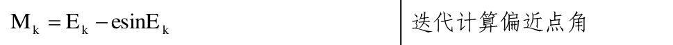

# 第一次作业报告-李嘉渝

李嘉渝 123035910063

# 作业要求

根据下面提供的 RINEX v4 格式报文数据（Chapter 3 课件的 123 页），计算北斗导航卫星 C30 在 2023 年 1 月 1 日 1 时 0 分 30 秒的：

1、轨道参数

2、钟差


# 1 报文解析过程

## 1.1 源数据寻找

在 NASA earthdata 上找到了和 ppt 上一模一样的数据：

[https://cddis.nasa.gov/archive/gnss/data/daily/2023/brdc/](https://cddis.nasa.gov/archive/gnss/data/daily/2023/brdc/)


## 1.2 文件名解析

在文件 rinex_4.00 中有关于文件名称的解释，如图 x 所示。


因此，对于此文件，其文件名包含的信息如下：

DRD4 - 测站名称
0 - 标记号
0 - 接收机号为 0
DLR - 在 ISO 3166 中没查到对应的区域
S - 数据源为数据流
20230010000 - 时间为 2023 年第 001 天 00 时 00 分
01D - 文件持续时间为 1 天
MN - 数据类型为混合类型，包含所有 GNSS 卫星类型的数据
rnx - 文件格式，RINEX 文件，非压缩

## 1.3 报文内容解析

在 xxx 文件中有关于 EPH 报文的内容解释，如下图 x 所示。


表格中的每一行，对应了每一段报文中的每一行内容。将数据含义与数据一一匹配，并标注在原报文中，得到图 x。


## 1.4 MATLAB 中报文解析过程

- 源码

```matlab
% Load Data
data_read = fopen('.\data_process.rnx', 'r');
if data_read == -1
    error('Failed openning file %s', 'D:\projects\renix4_error_calc\data_process.rnx');
end
pattern = '\d{4}|\d\d|-?\d\.\d{12}e[+-]\d\d';
parameters = [];
while true
    % Read file line by line
    line = fgetl(data_read);
    % Check if ends up the file or not
    if line == -1
        break;
    end
    
    % Extract values needed
    data = regexp(line, pattern, 'match');
    
    % Check if there are value needed
    if ~isempty(data)
        % Add the value to parameter array
        parameters{end+1, 1} = data;
    end
end
% Close file
fclose(data_read);
% Constant variables
mu = 3.986005e14 % GM
omega_e = 7.292115147e-5
PI = 3.1415926535898
c = 299792458
% Read Data
t_oe = str2double(parameters{5}{1})   %5,1
t_tm = str2double(parameters{11}{1})   %11,1
sqrt_a = str2double(parameters{4}{4}) %4,4
DELTA_n = str2double(parameters{3}{3})  %3,3
M_0 = str2double(parameters{3}{4})    %3,4
e = str2double(parameters{4}{2}) %4,2
a_bias = str2double(parameters{2}{8}) %2,4(2,8 after fixing)
a_drift = str2double(parameters{2}{9}) %2,5(2,9 after fixing)
a_dr = str2double(parameters{2}{10}) %2,6(2,10 after fixing)
i_0 = str2double(parameters{6}{1}) %6,1
OMEGA_0 = str2double(parameters{5}{3}) %5,3
omega = str2double(parameters{6}{3}) %6,3
C_rc = str2double(parameters{6}{2}) %6,2
C_uc = str2double(parameters{4}{1}) %4,1
C_us = str2double(parameters{4}{3}) %4,3
C_rs = str2double(parameters{3}{2}) %3,2
C_ic = str2double(parameters{5}{2}) %5,2
C_is = str2double(parameters{5}{4}) %5,4
OMEGA_dot = str2double(parameters{6}{4}) %6,4; Diffrential of OMEGA
i_dot = str2double(parameters{7}{1}) %7,1; Diffrential of i
a = sqrt_a^2;
```

- 源码讲解
  1. 先使用 fopen()打开待解析的.rnx 文件；
  2. 依次读取文件每一行的内容，使用 fgetl()函数；
  3. 使用 regexp，利用合理的正则表达式方法来提取需要使用的信息，如此处采用的正则表达式提取公式如图 x 所示；
  4. 如果数据是需要的数据，则将其放入 parameter 数组中；
  5. 根据之前做好的报文数据标注图，在变量赋值时根据行列数进行相应的提取即可。

# 2 轨道参数和钟差计算过程

## 2.1 轨道参数计算

轨道参数计算的相关规则与过程可以参考《》第 29 到 33 页。如下图展示了星历参数的计算方法。


此处详细过程为：

### **Step 1 Compute mean anomaly and mean motion**

### Step 2 Solve eccentric anomaly



对应代码为：

```matlab
% Step 2: Solve eccentric anomaly
% Iteratively solve for eccentric anomaly
% 3 times iteration
E_k = M_k;
for i = 1:100
    E_k = M_k + e*sin(E_k);
end
```

此处要跌打求取 Ek 的值，初值就取 Ek = Mk。代码中迭代了 100 次，实测中迭代 3 次就可以达到比较好的收敛。

### Step 3 Compute true anomaly


对应代码为：

```matlab
% Step 3: Compute true anomaly
v_k = atan((sqrt(1-e^2)*sin(E_k))/(cos(E_k)-e))
```

### Step 4  Compute argument of latitude (of the satellite)


对应代码为：

```matlab
% Step 4: Compute argument of latitude (of the satellite)
PHI_k = omega + v_k
```

### Step 5 Compute corrections to Keplerian orbit


对应代码为：

```matlab
% Step 5: Compute corrections to Keplerian orbit
delta_u_k = C_uc*cos(2*PHI_k) + C_us*sin(2*PHI_k)
delta_r_k = C_rc*cos(2*PHI_k) + C_rs*sin(2*PHI_k)
delta_i_k = C_ic*cos(2*PHI_k) + C_is*sin(2*PHI_k)
```

### Step 6 Compute corrected values


对应代码为：

```matlab
% Step 6: Compute corrected values
u_k = PHI_k + delta_u_k
r_k = a*(1 - e*cos(E_k)) + delta_r_k
i_k = i_0 + i_dot*t_k + delta_i_k
```

### Step 7 Correct the longitude of ascending node


对应代码为：

```matlab
% Step 7: Correct longitude of ascending node
OMEGA_k = (OMEGA_0 - omega_e*t_oe) + (OMEGA_dot - omega_e)*t_k
```

### Step 8 Compute position at time of transmission


对应代码为：

```matlab
% Step 8: Compute position at time of transmission
x = r_k*cos(u_k)
y = r_k*sin(u_k)
X_k = x*cos(OMEGA_k) - y*cos(i_k)*sin(OMEGA_k)
Y_k = x*sin(OMEGA_k) + y*cos(i_k)*cos(OMEGA_k)
Z_k = y*sin(i_k)
```

## 2.2 钟差参数计算

钟差计算的相关规则与过程可以参考《》第 27 到 28 页。如下图展示了钟差参数的计算方法。


对应代码为：

```matlab
% Clock bias calculation
FF=-2*sqrt(mu)/(c^2);
DetTr = FF*e*sqrt_a*sin(E_k);
Clock_bias = a_bias +a_drift*t_oe+a_dr*(t_oe^2)+DetTr;
```

# 3 计算结果

- 长半轴 a: 2.790604e+07
- 平均角速度 n0: 1.354321e-04
- 观测历元到参考历元的时间差 tk: 3.000000e+01
- 改正平均角速度 n: 1.354361e-04
- 平近点角 Mk: 6.731831e-01
- 偏近点角 Ek: 6.734663e-01
- 真近点角 vk: 6.737496e-01
- 纬度幅角 Φk: 8.319887e-01
- 纬度幅角改正项 δuk: 4.442884e-06
- 径向改正项 δrk: -9.167331e+01
- 轨道倾角改正项 δik: -2.911519e-09
- 改正后的纬度幅角 uk: 8.319931e-01
- 改正后的径向 rk: 2.789604e+07
- 改正后的轨道倾角 ik: 9.622581e-01
- 卫星在轨道平面内的坐标 x: 1.878530e+07
- 卫星在轨道平面内的坐标 y: 2.062285e+07
- **历元升交点经度 Xk: -3.753289e+06**
- **历元升交点经度 Yk: -2.185843e+07**
- **历元升交点经度 Zk: 1.692073e+07**
- **卫星钟差: 1.235420e-06**

# 4 源码

```matlab
% Jason Lee <jason_lee@sjtu.edu.cn>
% SJTU SEIEE
% Created: November 8, 2023
clear all
clc
close all
% Load Data
data_read = fopen('.\data_process.rnx', 'r');
if data_read == -1
    error('Failed openning file %s', 'D:\projects\renix4_error_calc\data_process.rnx');
end
pattern = '\d{4}|\d\d|-?\d\.\d{12}e[+-]\d\d';
parameters = [];
while true
    % Read file line by line
    line = fgetl(data_read);
    % Check if ends up the file or not
    if line == -1
        break;
    end
    
    % Extract values needed
    data = regexp(line, pattern, 'match');
    
    % Check if there are value needed
    if ~isempty(data)
        % Add the value to parameter array
        parameters{end+1, 1} = data;
    end
end
% Close file
fclose(data_read);
% Constant variables
mu = 3.986005e14 % GM
omega_e = 7.292115147e-5
PI = 3.1415926535898
c = 299792458
% Read Data
t_oe = str2double(parameters{5}{1})   %5,1
t_tm = str2double(parameters{11}{1})   %11,1
sqrt_a = str2double(parameters{4}{4}) %4,4
DELTA_n = str2double(parameters{3}{3})  %3,3
M_0 = str2double(parameters{3}{4})    %3,4
e = str2double(parameters{4}{2}) %4,2
a_bias = str2double(parameters{2}{8}) %2,4(2,8 after fixing)
a_drift = str2double(parameters{2}{9}) %2,5(2,9 after fixing)
a_dr = str2double(parameters{2}{10}) %2,6(2,10 after fixing)
i_0 = str2double(parameters{6}{1}) %6,1
OMEGA_0 = str2double(parameters{5}{3}) %5,3
omega = str2double(parameters{6}{3}) %6,3
C_rc = str2double(parameters{6}{2}) %6,2
C_uc = str2double(parameters{4}{1}) %4,1
C_us = str2double(parameters{4}{3}) %4,3
C_rs = str2double(parameters{3}{2}) %3,2
C_ic = str2double(parameters{5}{2}) %5,2
C_is = str2double(parameters{5}{4}) %5,4
OMEGA_dot = str2double(parameters{6}{4}) %6,4; Diffrential of OMEGA
i_dot = str2double(parameters{7}{1}) %7,1; Diffrential of i
a = sqrt_a^2;
% Step 1: Compute mean anomaly and mean motion
% Compute the relative time, where t is the time of transmission
% t_k = t - t_oe
t_k = 30
% Compute the mean motion
n_o = sqrt(mu/(a^3))
% Correct the mean motion
n = n_o + DELTA_n
% Compute the anomaly at time of transmission
M_k = M_0 + n*t_k
% Step 2: Solve eccentric anomaly
% Iteratively solve for eccentric anomaly
% 3 times iteration
E_k = M_k;
for i = 1:100
    E_k = M_k + e*sin(E_k);
end
% Step 3: Compute true anomaly
v_k = atan((sqrt(1-e^2)*sin(E_k))/(cos(E_k)-e))
% Step 4: Compute argument of latitude (of the satellite)
PHI_k = omega + v_k
% Step 5: Compute corrections to Keplerian orbit
delta_u_k = C_uc*cos(2*PHI_k) + C_us*sin(2*PHI_k)
delta_r_k = C_rc*cos(2*PHI_k) + C_rs*sin(2*PHI_k)
delta_i_k = C_ic*cos(2*PHI_k) + C_is*sin(2*PHI_k)
% Step 6: Compute corrected values
u_k = PHI_k + delta_u_k
r_k = a*(1 - e*cos(E_k)) + delta_r_k
i_k = i_0 + i_dot*t_k + delta_i_k
% Step 7: Correct longitude of ascending node
OMEGA_k = (OMEGA_0 - omega_e*t_oe) + (OMEGA_dot - omega_e)*t_k
% Step 8: Compute position at time of transmission
x = r_k*cos(u_k)
y = r_k*sin(u_k)
X_k = x*cos(OMEGA_k) - y*cos(i_k)*sin(OMEGA_k)
Y_k = x*sin(OMEGA_k) + y*cos(i_k)*cos(OMEGA_k)
Z_k = y*sin(i_k)
% Clock bias calculation
FF=-2*sqrt(mu)/(c^2);
DetTr = FF*e*sqrt_a*sin(E_k);
Clock_bias = a_bias +a_drift*t_oe+a_dr*(t_oe^2)+DetTr;
% result = [
%             cos(-OMEGA_k),-sin(-OMEGA_k),0;
%             sin(-OMEGA_k),cos(-OMEGA_k),0;
%             0,0,1
%         ] * [
%             1,0,0;
%             0,cos(-i_k),-sin(-i_k);
%             0,sin(-i_k),cos(-i_k)
%         ] * [
%             cos(-u_k),-sin(-u_k),0;
%             sin(-u_k),cos(-u_k),0;
%             0,0,1
%         ] * ([
%             r_k,0,0
%         ].')
% Step 9: Account for Earth rotation during propagation time
% result_p = [
%             cos(omega_e*t_tm),-sin(omega_e*t_tm),0;
%             sin(omega_e*t_tm),cos(omega_e*t_tm),0;
%             0,0,1
%         ]*result
% Save the result values
% Defines the variable to be stored and the corresponding variable name
variables = {
    '长半轴a', a;
'平均角速度n0', n_o;
'观测历元到参考历元的时间差tk', t_k;
'改正平均角速度n', n;
'平近点角Mk', M_k;
'偏近点角Ek', E_k;
'真近点角vk', v_k;
'纬度幅角Φk', PHI_k;
'纬度幅角改正项δuk', delta_u_k;
'径向改正项δrk', delta_r_k;
'轨道倾角改正项δik', delta_i_k;
'改正后的纬度幅角uk', u_k;
'改正后的径向rk', r_k;
'改正后的轨道倾角ik', i_k;
'卫星在轨道平面内的坐标x', x;
'卫星在轨道平面内的坐标y', y;
'历元升交点经度Xk', X_k;
'历元升交点经度Yk', Y_k;
'历元升交点经度Zk', Z_k;
'卫星钟差Clock Bias', Clock_bias;
};
filename = 'output.txt';
% Open the file for writing
fileID = fopen(filename, 'w');
% Loop writes variable names and values to the file
for i = 1:size(variables, 1)
    varName = variables{i, 1};
    varValue = variables{i, 2};
    fprintf(fileID, '%s: %e\n', varName, varValue);
end
% Close file
fclose(fileID);
disp('Values are already saved in output.txt under the main code path')
```

# 5 Reference

1.
2.
3.
4. [https://zhuanlan.zhihu.com/p/111325516](https://zhuanlan.zhihu.com/p/111325516)
5. [https://blog.csdn.net/weixin_42425959/article/details/102887580](https://blog.csdn.net/weixin_42425959/article/details/102887580)
6. [https://c.runoob.com/front-end/854/](https://c.runoob.com/front-end/854/)
7. [https://blog.csdn.net/Gou_Hailong/article/details/109191352](https://blog.csdn.net/Gou_Hailong/article/details/109191352)
8. [https://cddis.nasa.gov/archive/gnss/data/daily/2023/brdc/](https://cddis.nasa.gov/archive/gnss/data/daily/2023/brdc/)
